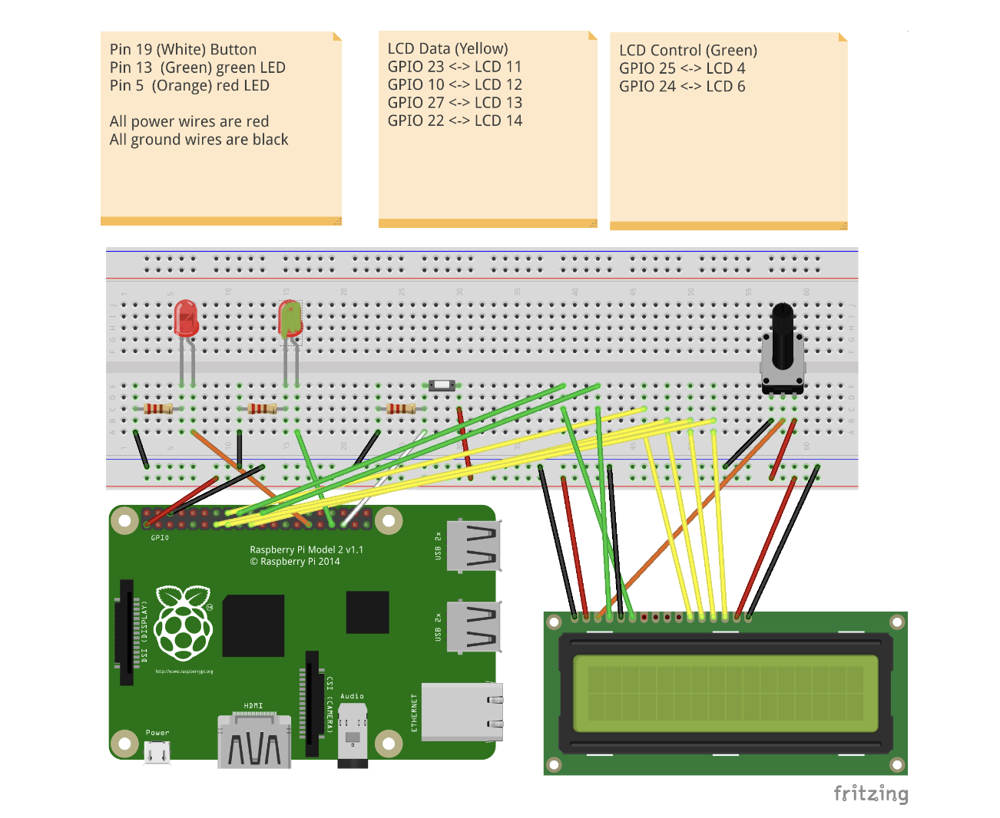

# Mastermind game on Raspberry Pi

[]()
[]()
[]()

This pair project showcases the implementation of Mastermind game developed using both C and ARM Assembler, on a Raspberry Pi. Created as part of the Hardware-Software Interface course at Heriot-Watt University.

The [CW specification is here](https://www.macs.hw.ac.uk/~hwloidl/Courses/F28HS/F28HS_CW2_2022.pdf)

## Project Overview

**Game Logic:** Developed in C for generating secret codes, handling user input, and game mechanics.

**Pattern Matching:** Implemented in ARM Assembly (mm-matches.s) to compute exact and approximate matches.

**Hardware Control:** Inline Assembler (lcdBinary.c) is used to drive an LED, a push-button, and an LCD display via GPIO on the Raspberry Pi.

## Contents

| File            | Description                                                                                                            |
| --------------- | ---------------------------------------------------------------------------------------------------------------------- |
| `master-mind.c` | the main C program for the CW implementation, and most aux fcts                                                        |
| `mm-matches.s`  | the matching function, implemented in ARM Assembler                                                                    |
| `lcdBinary.c`   | the low-level code for hardware interaction with LED, button, and LCD; this should be implemented in inline Assembler; |
| `testm.c`       | a testing function to test C vs Assembler implementations of the matching function                                     |
| `test.sh`       | a script for unit testing the matching function, using the -u option of the main prg                                   |

## Installation Instructions

Follow these steps to set up and run the Mastermind game on your Raspberry Pi:

### 1. Clone the Repository

```bash
git clone https://github.com/Vaishnavi-chintha/Mastermind_RaspberryPi
```

### 2. Install Dependencies

Ensure you have gcc and make installed. If not, run:

```bash
sudo apt update
sudo apt install build-essential
```

You may also need to enable GPIO access:

```bash
sudo apt install wiringpi
```

## Building and running the project

Run make in terminal

```bash
make all
```

and run the Master Mind program in debug mode by typing

```bash
 make run
```

and do unit testing on the matching function

```bash
make unit
```

or alternatively check C vs Assembler version of the matching function

```bash
 make test
```

check if the tests pass

```bash
echo $?
```

which should print `0`.

## Unit testing

This is an example of doing unit-testing on 2 sequences (C part only):

```bash
> ./cw2 -u 121 313
> 0 exact matches
> 1 approximate matches
```

The general format for the command line is as follows (see template code in `master-mind.c` for processing command line options):

```bash
./cw2 [-v] [-d] [-s] <secret sequence> [-u <sequence1> <sequence2>]
```

## Wiring

| Component                          | GPIO Pin                   |
| ---------------------------------- | -------------------------- |
| Green LED                          | `13`                       |
| Red LED                            | `5`                        |
| Button ( with resistors )          | `19`                       |
| LCD Display ( with potentiometer ) | Standard wiring via header |

## Fritzing Diagram

The Fritzing diagram below visualises this wiring.



## Contributors:

- **Vaishnavi Chintha** [`@Vaishnavi-chintha`](https://github.com/Vaishnavi-chintha)
- **Ihsan Fazal** [`Ihsan-Fazal`](https://github.com/Ihsan-Fazal)
